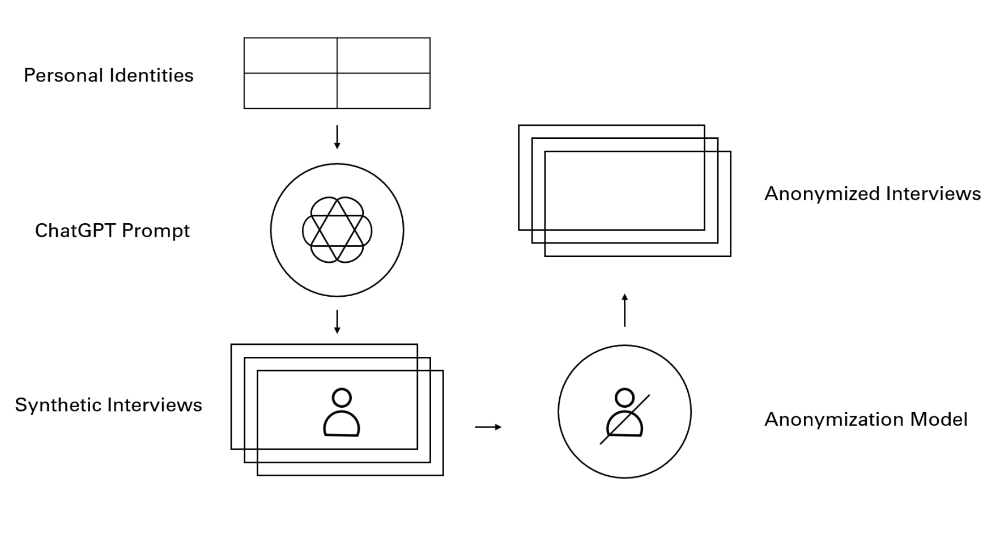
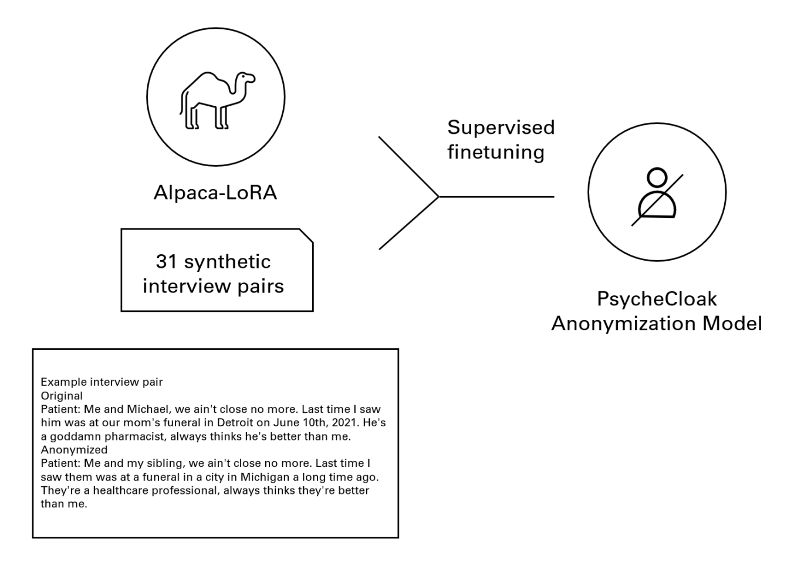
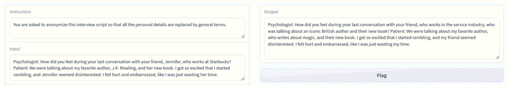
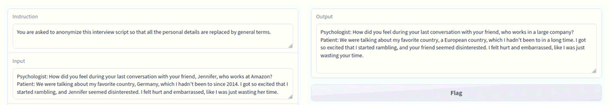

# PsycheCloak
Welcome to PsycheCloak, a model for anonymizing in-depth psychology interviews while preserving the richness and complexity of the data. This model was developed as part of a Hackathon project by a team of researchers and data scientists who recognized the importance of protecting the privacy and anonymity of research participants while still making valuable data available for research purposes.

PsycheCloak uses synthetic interview transcripts generated by ChatGPT and guidelines based on existing literature and best practices to train a model to anonymize real interview transcripts. The model is trained using a method similar to transfer learning, which leverages the power of pre-trained language models to achieve good results even with limited training data.

Our code repository contains the source code and documentation for PsycheCloak, including instructions for installing and using the model, as well as examples of anonymized transcripts. We hope that this model will be useful for researchers in the field of mental health who are seeking to anonymize sensitive data in a way that maximizes participant privacy while maintaining data integrity.
Please feel free to contribute to our code repository or provide feedback on our model. Thank you for your interest in PsycheCloak!

## Concept Illustration

Pipeline Illustration

Model Finetuning

## Sample Outputs

Following is an anonymization on a synthetic interview question unseen in the training set.

Following is the same interview question with some personal details modified.

## Folder description

`trained_models` contains the trained models, finetuned from [alpaca-lora][1] as the base model, which reproduces the [Stanford's Alpaca][2] results using low-rank adaptation (LoRA). To run our model on `alpaca-lora`, please place our pretrained model in the root directory and specify ` --lora_weights='psycloak_11_1m4_31_V1'`(Training LoRA weights from scratch) or ` --lora_weights='psycloak_11_1m4_31_V2'`(from pretrained alpaca-lora) as needed.

`training_data` contains various training sets used for finetuning the language model. In our demo, we use `PsycheCloak_data_31.json` as the training set.

`prompts` contains the prompts fed to the ChatGPT API to generate synthetic psychological interviews, and to anonymize them.

[1]: <https://github.com/tloen/alpaca-lora> "Alpaca-Lora"
[2]: <https://crfm.stanford.edu/2023/03/13/alpaca.html> "Stanford Alpaca"

